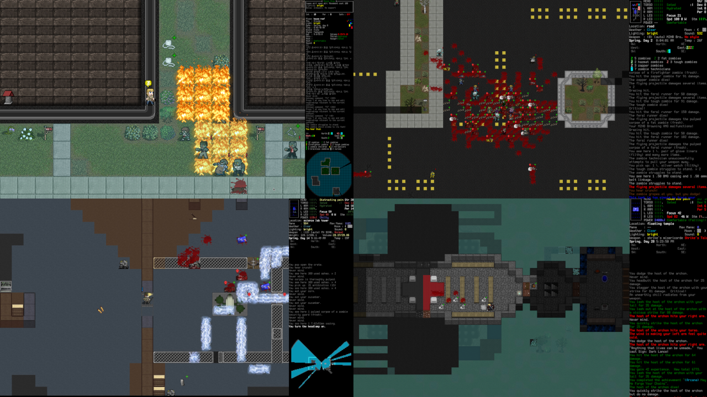
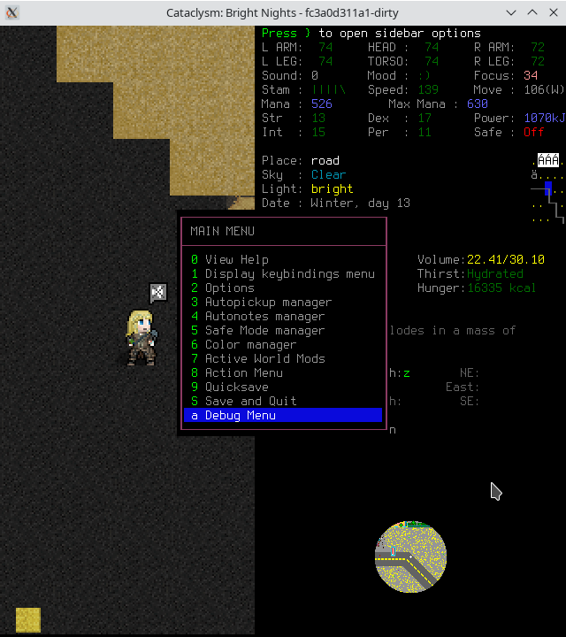
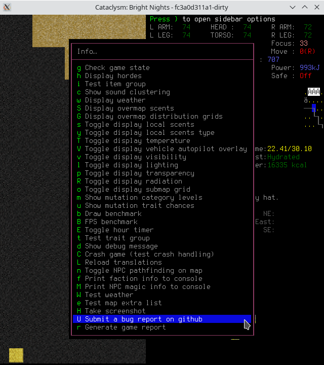
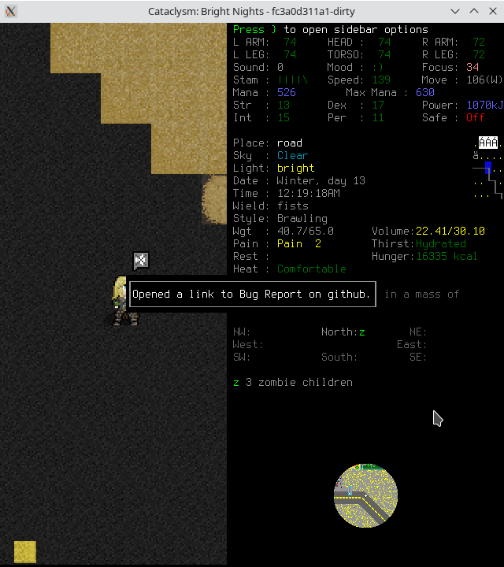

# Cataclysm: Bright Nights

<header align="center">
  

[![en][icon-en]][en] [![ko][icon-ko]][ko]

</header>

[en]: ./README.md
[icon-en]: https://img.shields.io/badge/lang-en-red?style=flat-square
[ko]: ./README.ko.md
[icon-ko]: https://img.shields.io/badge/lang-ko-orange?style=flat-square

Cataclysm: Bright Nights is a roguelike with sci-fi elements set in a post-apocalyptic world.

While some have described it as a "zombie game", there is far more to Cataclysm than that. Struggle
to survive in a harsh, persistent, procedurally generated world. Scavenge the remnants of a dead
civilization for food, equipment, or, if you are lucky, a vehicle with a full tank of gas to get you
the hell out of there.

Fight to defeat or escape from a wide variety of powerful monstrosities, from zombies to giant
insects to killer robots and things far stranger and deadlier, and against the others like yourself,
who want what you have.

Find a way to stop the Cataclysm ... or become one of its strongest monsters.

> Cataclysm: Bright Nights is a fork of Cataclysm: Dark Days Ahead.
> [see the differences from its ancestor.](https://docs.cataclysmbn.org/game/changelog/).

## Downloads

### Executables

[![Stable][stable-releases-badge]][stable-releases] [![Recent][all-releases-badge]][all-releases] [![Experiemental][experimental-badge]][experimental-releases] [![Flatpak][flathub-badge]][flathub-releases]

#### Linux Instructions

While many of the dependencies that the game depends on are likely installed by default, some likely aren't installed by default on your distro.

Here are the commands for some of the most popular distro families:

- Ubuntu / Debian: `sudo apt install libsdl2-image-2.0.0 libsdl2-ttf-2.0.0 libsdl2-mixer-2.0.0 libfreetype6 zip libsqlite3-0`
- Fedora: `sudo dnf install SDL2 SDL2_image SDL2_ttf SDL2_mixer freetype zip sqlite`
- Arch: `sudo pacman -S sdl2 sdl2_image sdl2_ttf sdl2_mixer zip sqlite`

### Launchers

The primary supported launcher is [Catapult](https://github.com/qrrk/Catapult), which can handle both BN and DDA (it defaults to DDA, so be sure to change it in the top menu!)

### Source Code

[![Source Code][source-badge]][source] [![Zip Archive][clone-badge]][clone]

[stable-releases]: https://github.com/cataclysmbnteam/Cataclysm-BN/releases/latest "Download stable executable"
[stable-releases-badge]: https://img.shields.io/github/v/release/cataclysmbnteam/Cataclysm-BN?style=for-the-badge&color=success&label=stable
[all-releases]: https://github.com/cataclysmbnteam/Cataclysm-BN/releases?q=prerelease%3Atrue&expanded=true
[all-releases-badge]: https://img.shields.io/github/v/release/cataclysmbnteam/Cataclysm-BN?style=for-the-badge&color=important&label=Latest%20Release&include_prereleases&sort=date
[experimental-releases]: https://github.com/cataclysmbnteam/Cataclysm-BN/releases/tag/experimental
[experimental-badge]: https://img.shields.io/github/v/release/cataclysmbnteam/Cataclysm-BN?style=for-the-badge&color=salmon&label=Experimental%20Release&include_prereleases&sort=date
[flathub-releases]: https://flathub.org/apps/org.cataclysmbn.CataclysmBN
[flathub-badge]: https://img.shields.io/flathub/v/org.cataclysmbn.CataclysmBN?style=for-the-badge&color=success
[source]: https://github.com/cataclysmbnteam/Cataclysm-BN/archive/master.zip "The source can be downloaded as a .zip archive"
[source-badge]: https://img.shields.io/badge/Zip%20Archive-black?style=for-the-badge&logo=github
[clone]: https://github.com/cataclysmbnteam/Cataclysm-BN/ "clone from our GitHub repo"
[clone-badge]: https://img.shields.io/badge/Clone%20From%20Repo-black?style=for-the-badge&logo=github

## Building

- [with cmake](docs/en/dev/guides/building/cmake.md)
- [with makefile](docs/en/dev/guides/building/makefile.md): supports Linux, macOS,
  and BSD.
- [with MSYS2](docs/en/dev/guides/building/msys.md)
- [with vcpkg](docs/en/dev/guides/building/vs_vcpkg.md)

Please read the [official docs](https://docs.cataclysmbn.org/dev/guides/building/cmake/) for
details.

## Contributing

> Cataclysm: Bright Nights developed under Creative Commons Attribution ShareAlike 3.0 license. The
> code and content of the game is free to use, modify, and redistribute for any purpose whatsoever.
> See http://creativecommons.org/licenses/by-sa/3.0/ for details. Some code distributed with the
> project is not part of the project and is released under different software licenses, the files
> covered by different software licenses have their own license notices.

Please check the [official docs](https://docs.cataclysmbn.org/contribute/contributing/) for
details.

## Documentation

Gameplay and developing documentation is available in the [doc](./docs/) directory
in markdown format. You can also

- visit the [official docs](https://docs.cataclysmbn.org/) site
- [build and serve the documentation locally](./docs/en/contribute/docs.md)

## Community

[][docs]
[][discussion]
[][discord]
[][modding]

[discussion]: https://github.com/cataclysmbnteam/Cataclysm-BN/discussions
[discord]: https://discord.gg/XW7XhXuZ89
[modding]: https://discord.gg/B5q4XCa "Unofficial DDA modding community discord has a BN channel"
[docs]: https://docs.cataclysmbn.org "Official BN documentation"

## Frequently Asked Questions

#### Is there a tutorial?

Yes, you can find the tutorial in the **Special** menu at the main menu (be aware that due to many
code changes the tutorial may not function). You can also access documentation in-game via the `?`
key.

#### How can I change the key bindings?

Press the `?` key, followed by the `1` key to see the full list of key commands. Press the `+` key
to add a key binding, select which action with the corresponding letter key `a-w`, and then the key
you wish to assign to that action.

#### How can I start a new world?

**World** on the main menu will generate a fresh world for you. Select **Create World**.

#### There is no music (or sound) in the game. How can I add it?

Third-party launchers, such as [Catapult](https://github.com/qrrk/Catapult), allow you to install sound packs (and mods) from the launcher menu. You can also do it manually. To add a sound pack, download and unzip it to `<Game Folder>\data\sound\`, select it from the settings, and then restart the game. The recommended one is [Otopack](https://github.com/RoyalFox2140/Otopack-2-BN).

#### Where should I put 3rd-party mods?

Where you put the third party mods depends on whether you installed manually or with Catapult. No matter which you do, 3rd party mods do **not** go in data/mods. That folder should be reserved for in-repo mods only, especially given Catapult will automatically delete the contents of that folder!

For a manual installation, you should use the player-mods folder (if it is not present, you are either using an older version and should manually create a folder in the base cataclysm folder yourself or you are using XDG or Home directories on a supported platform)

For Catapult, you would put them in bn/userdata/mods (creating the folder if it's not already there) inside your catapult installation. For example, it might look like Catapult/bn/userdata/mods.

For Linux users using the XDG directories (but NOT the flatpak): The user mods directory should be in `~/.local/share/cataclysm-bn/mods` (`~/.local/share/cataclysm-bn` is the user directory in general)

For flatpak users, the user mods folder is `~/.var/app/org.cataclysmbn.CataclysmBN/data/cataclysm-bn/mods` (the user directory in general is `~/.var/app/org.cataclysmbn.CataclysmBN/data/cataclysm-bn/`)

#### How do I update the game manually?

Assuming you've managed your mods appropriately, the correct update process is to delete the old data folder (alongside the gfx folder if you want to be extra safe) and _then_ overwrite the contents of the old BN folder with the new BN download. Deleting the old data folder is specifically necessary due to the fact that simply overwriting the old folder will **not** account for updates which delete files, as may happen with the obsoletion folder for example.

Don't delete your saves folder, memorial, graveyard, etc.!

Alternatively, you can always use the Catapult launcher and let it handle updating. It has a good track record of correctly updating the vanilla game.

#### I've found a bug. What should I do?

[Bug report](https://github.com/cataclysmbnteam/Cataclysm-BN/issues/new?template=bug_report.yml) can
be submitted via debug menu.

Run `Submit a bug report on github` inside the game to submit an issue.

|   1. open Options (ESC) -> Debug Menu (a)   |              2. open Info (i)               |
| :-----------------------------------------: | :-----------------------------------------: |
|  |  |
|    3. Submit a bug report on github (U)     |      4. An link to issue is generated       |
|  |  |

It will open a bug report on browser with `Version and configuration` filled in.

#### I would like to make a suggestion. What should I do?

- For simple ideas: please visit
  [our Discussions page](https://github.com/cataclysmbnteam/Cataclysm-BN/discussions/categories/ideas).
  It could be a new feature, a port request, a mod idea, or anything else.
- Please submit an issue on
  [our GitHub page](https://github.com/cataclysmbnteam/Cataclysm-BN/issues/) using
  [feature request form](https://github.com/cataclysmbnteam/Cataclysm-BN/issues/new?template=feature_request.yml).
