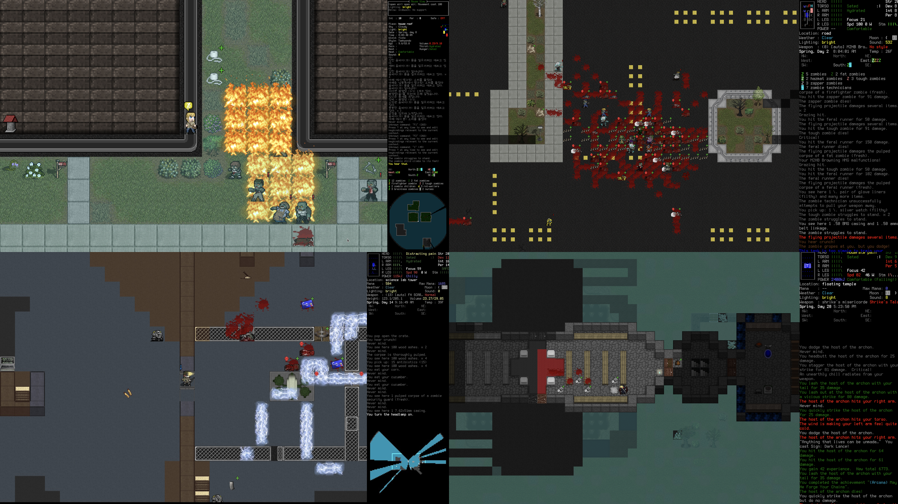

# Cataclysm: Bright Nights

Cataclysm: Bright Nights is a roguelike with sci-fi elements set in a post-apocalyptic world.

While some have described it as a "zombie game", there is far more to Cataclysm than that. Struggle to survive in a harsh, persistent, procedurally generated world. Scavenge the remnants of a dead civilization for food, equipment, or, if you are lucky, a vehicle with a full tank of gas to get you the hell out of there.

Fight to defeat or escape from a wide variety of powerful monstrosities, from zombies to giant insects to killer robots and things far stranger and deadlier, and against the others like yourself, who want what you have.

Find a way to stop the Cataclysm ... or become one of its strongest monsters.

> Cataclysm: Bright Nights is a fork of Cataclysm: Dark Days Ahead.
> [see the differences from its ancestor on the wiki](https://github.com/cataclysmbnteam/Cataclysm-BN/wiki/Changes-so-far).

## Downloads

[![Stable][stable-releases-badge]][stable-releases] [![Recent][all-releases-badge]][all-releases]

[stable-releases]: https://github.com/cataclysmbnteam/Cataclysm-BN/releases/tag/cbn-0.1
[stable-releases-badge]: <https://img.shields.io/badge/Stable Release-0.1-success?style=for-the-badge>
[all-releases]: https://github.com/cataclysmbnteam/Cataclysm-BN/releases
[all-releases-badge]: https://img.shields.io/github/v/release/cataclysmbnteam/Cataclysm-BN?color=important&include_prereleases&label=Latest%20Release&sort=semver&style=for-the-badge

| [Source Code][source-zip-archive] | [Clone From Repo][clone] |
| :-------------------------------: | :----------------------: |

[source-zip-archive]: https://github.com/cataclysmbnteam/Cataclysm-BN/archive/master.zip "The source can be downloaded as a .zip archive"
[clone]: https://github.com/cataclysmbnteam/Cataclysm-BN/ "clone from our GitHub repo"

## Compile

Please read [COMPILING.md](doc/COMPILING/COMPILING.md) - it covers general information and more specific recipes for Linux, OS X, Windows and BSD. See [COMPILER_SUPPORT.md](doc/COMPILING/COMPILER_SUPPORT.md) for details on which compilers we support. And you can always dig for more information in [doc/](https://github.com/cataclysmbnteam/Cataclysm-BN/tree/upload/doc).

We also have the following build guides:

-   Building on Windows with `MSYS2` at [COMPILING-MSYS.md](doc/COMPILING/COMPILING-MSYS.md)
-   Building on Windows with `vcpkg` at [COMPILING-VS-VCPKG.md](doc/COMPILING/COMPILING-VS-VCPKG.md)
-   Building with `cmake` at [COMPILING-CMAKE.md](doc/COMPILING/COMPILING-CMAKE.md) (_unofficial guide_)

## Contribute

> Cataclysm: Bright Nights developed under Creative Commons Attribution ShareAlike 3.0 license. The code and content of the game is free to use, modify, and redistribute for any purpose whatsoever. See http://creativecommons.org/licenses/by-sa/3.0/ for details.
> Some code distributed with the project is not part of the project and is released under different software licenses, the files covered by different software licenses have their own license notices.

Please see [CONTRIBUTING.md](.github/CONTRIBUTING.md) for details.

## Community

| [Repository][repo] | [Discussions][discussion] | [Official Discord][discord] | [BN Channel@Modding Community][modding] |
| :----------------: | :-----------------------: | :-------------------------: | :-------------------------------------: |

[repo]: https://github.com/cataclysmbnteam/Cataclysm-BN
[discussion]: https://github.com/cataclysmbnteam/Cataclysm-BN/discussions
[discord]: https://discord.gg/XW7XhXuZ89
[modding]: https://discord.gg/B5q4XCa "Unofficial DDA modding community discord has a BN channel"

## Frequently Asked Questions

#### Is there a tutorial?

Yes, you can find the tutorial in the **Special** menu at the main menu (be aware that due to many code changes the tutorial may not function). You can also access documentation in-game via the `?` key.

#### How can I change the key bindings?

Press the `?` key, followed by the `1` key to see the full list of key commands. Press the `+` key to add a key binding, select which action with the corresponding letter key `a-w`, and then the key you wish to assign to that action.

#### How can I start a new world?

**World** on the main menu will generate a fresh world for you. Select **Create World**.

#### I've found a bug. What should I do?

Please submit an issue on [our GitHub page](https://github.com/cataclysmbnteam/Cataclysm-BN/issues) using [bug report form](https://github.com/cataclysmbnteam/Cataclysm-BN/issues/new?template=bug_report.yml).

#### I would like to make a suggestion. What should I do?

-   For simple ideas: please visit [our Discussions page](https://github.com/cataclysmbnteam/Cataclysm-BN/discussions/categories/ideas). It could be a new feature, a port request, a mod idea, or anything else.
-   Please submit an issue on [our GitHub page](https://github.com/cataclysmbnteam/Cataclysm-BN/issues/) using [feature request form](https://github.com/cataclysmbnteam/Cataclysm-BN/issues/new?template=feature_request.yml).
