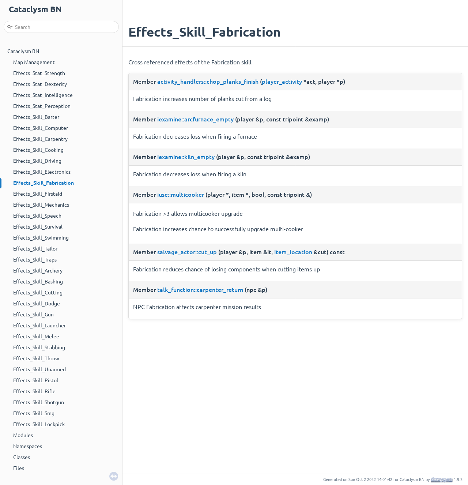

:::tip{title="Opening new issue"}

Check [how to open a issue](./issues).

:::

# Want to help?

Help is appreciated, especially with:

- Reporting bugs. Including ones inherited from DDA.
- Identifying problems that aren't bugs. Misleading descriptions, values that are clearly off
  compared to similar cases, grammar mistakes, UI wonkiness that has an obvious solution.
- Making useless things useful or putting them on a blacklist. Adding deconstruction recipes for
  things that should have them but don't, replacing completely redundant items with their generic
  versions (say, "tiny marked bottle" with just "tiny bottle") in spawn lists.
- Tileset work. I'm occasionally adding new objects, like the new electric grid elements, and they
  could use new tiles.
- Balance analysis. Those should be rather in depth or "obviously correct". Obviously correct would
  be things like: "weapon x has strictly better stats than y, but y requires rarer components and
  has otherwise identical requirements".
- Identifying performance bottlenecks with a profiler.
- Code quality help.

## How-to

Contributing to Cataclysm: Bright Nights is easy:

1. Fork the repository here on GitHub.
2. Make your changes.
3. Send us a pull request.

:::note{title="License"}

Cataclysm: Bright Nights is released under the Creative Commons Attribution ShareAlike 3.0 license.
The code and content of the game is free to use, modify, and redistribute for any purpose
whatsoever. See http://creativecommons.org/licenses/by-sa/3.0/ for details. This means any
contribution you make to the project will also be covered by the same license, and this license is
irrevocable.

:::

## Guidelines

There are a couple of guidelines we suggest sticking to:

- Add this repository as an `upstream` remote.
- Keep your `upload` branch clean. This means you can easily pull changes made to this repository
  into yours.
- Create a new branch for each new feature or set of related bug fixes.
- Never merge from your local branches into your `upload` branch. Only update that by pulling from
  `upstream/upload`.

## Code Style

### C++

Code style is enforced across the codebase by `astyle`. See
[CODE_STYLE](../dev/explanation/code_style.md) for details.

### JSON

JSON files are formatted using custom formatter available in `tools/format`. Visit
[JSON Style Guide](../mod/json/explanation/json_style.md) for details.

### Markdown

Markdown files such as `doc/` are formatted using [`deno`](https://deno.com)'s built-in formatter.
Run [`deno fmt`](https://deno.land/manual/tools/formatter) anywhere to format markdown files. On
VSCode, you can set following configuration to auto-format markdown files on save:

```json
// .vscode/settings.json
{
  "[markdown]": {
    "editor.formatOnSave": true,
    "editor.defaultFormatter": "denoland.vscode-deno"
  }
}
```

## Translations

The translation of Cataclysm: BN is done using Transifex. Look at the
[translation project](https://app.transifex.com/bn-team/cataclysm-bright-nights/) for an up-to-date
list of supported languages.

For more information:

- [For translators](../i18n/tutorial/transifex)
- [For developers](../i18n/reference/translation)
- [For maintainers](../i18n/guides/maintain)

## Documentation

<!--



Autogenerated documentation is hosted on
[GitHub Pages](https://cataclysmbnteam.github.io/Cataclysm-BN). -->

### Doxygen Comments

Extensive documentation of classes and class members will make the code more readable to new
contributors. New doxygen comments for existing classes are a welcomed contribution.

Use the following template for commenting classes:

```cpp
/**
 * Brief description
 *
 * Lengthy description with many words. (optional)
 */
class foo {

}
```

Use the following template for commenting functions:

```cpp
/**
 * Brief description
 *
 * Lengthy description with many words. (optional)
 * @param param1 Description of param1 (optional)
 * @return Description of return (optional)
 */
int foo(int param1);
```

Use the following template for commenting member variables:

```cpp
/** Brief description **/
int foo;
```

### Guidelines for adding documentation

- Doxygen comments should describe behavior towards the outside, not implementation, but since many
  classes in Cataclysm are intertwined, it's often necessary to describe implementation.
- Describe things that aren't obvious to newcomers just from the name.
- Don't describe redundantly: `/** Map **/; map* map;` is not a helpful comment.
- When documenting X, describe how X interacts with other components, not just what X itself does.

### Building the documentation for viewing it locally

- Install doxygen
- `doxygen doxygen_doc/doxygen_conf.txt`
- `firefox doxygen_doc/html/index.html` (replace firefox with your browser of choice)

## Example Workflow

### Setup your environment

_(This only needs to be done once.)_

1. Fork this repository here on GitHub.

1. Clone your fork locally.

```sh
$ git clone https://github.com/YOUR_USERNAME/Cataclysm-BN.git
# Clones your fork of the repository into the current directory in terminal
```

3. Set commit message template.

```sh
$ git config --local commit.template .gitmessage
```

4. Add this repository as a remote.

```sh
$ cd Cataclysm-BN
# Changes the active directory in the prompt to the newly cloned "Cataclysm-BN" directory
$ git remote add -f upstream https://github.com/cataclysmbnteam/Cataclysm-BN.git
# Assigns the original repository to a remote called "upstream"
```

For further details about commit message guidelines please visit:

- [codeinthehole.com](https://codeinthehole.com/tips/a-useful-template-for-commit-messages/)
- [chris.beams.io](https://chris.beams.io/posts/git-commit/)
- [help.github.com](https://help.github.com/articles/closing-issues-using-keywords/)

### Update your `upload` branch

1. Make sure you have your `upload` branch checked out.

```sh
$ git checkout upload
```

2. Pull the changes from the `upstream/upload` branch.

```sh
$ git pull --ff-only upstream upload
# gets changes from "upload" branch on the "upstream" remote
```

> **Note** If this gives you an error, it means you have committed directly to your local `upload`
> branch.
> [Click here for instructions on how to fix this issue](#why-does-git-pull---ff-only-result-in-an-error).

### Make your changes

0. Update your `upload` branch, if you haven't already.

1. For each new feature or bug fix, create a new branch.

```sh
$ git branch new_feature
# Creates a new branch called "new_feature"
$ git checkout new_feature
# Makes "new_feature" the active branch
```

2. Once you've committed some changes locally, you need to push them to your fork here on GitHub.

```sh
$ git push origin new_feature
# origin was automatically set to point to your fork when you cloned it
```

3. Once you're finished working on your branch, and have committed and pushed all your changes,
   submit a pull request from your `new_feature` branch to this repository's `upload` branch.

> **Note** any new commits to the `new_feature` branch on GitHub will automatically be included in
> the pull request, so make sure to only commit related changes to the same branch.

## Pull Request Notes

If you file a PR but you're still working on it, please mark it as
[draft](https://docs.github.com/en/pull-requests/collaborating-with-pull-requests/proposing-changes-to-your-work-with-pull-requests/about-pull-requests#draft-pull-requests).
This can help speed up our review process by allowing us to only review the things that are ready
for it, and will prevent anything that isn't completely ready from being merged in.

It is not required to solve or reference an open issue to file a PR, however, if you do so, you need
to explain the problem your PR is solving in full detail.

### All PRs should have a `"Summary"` line

Summary is a one-line description of your change that will be extracted and added to the
[project changelog](../game/changelog/index.md)

The format is: `SUMMARY: Category "description"`

The categories to choose from are: Features, Content, Interface, Mods, Balance, Bugfixes,
Performance, Infrastructure, Build, I18N.

Example: `SUMMARY: Content "Adds new mutation category 'Mouse'"`

See the [Changelog Guidelines](./changelog_guidelines.md) for explanations of the categories.

### Closing issues using keywords

One more thing: when marking your PR as closing, fixing, or resolving issues, please include this
somewhere in the description:

```md
- {keyword} #{issue}
```

for example: `- fixed #12345`

### keyword

`{keyword}` must be one of the following:

- `close`, `closes`, `closed`
- `fix`, `fixes`, `fixed`
- `resolve`, `resolves`, `resolved`

### issue

and `{issue}` is the number of the issue you're closing after PR gets merged.

This would automatically close the issue when the PR is pulled in, and allows merges to work
slightly faster.

### closing multiple issues at once

```md
- {keyword} #{issue}, {keyword} #{issue}
```

See https://help.github.com/articles/closing-issues-using-keywords for more.

## Tooling support

Various tools are available to help you keep your contributions conforming to the appropriate style.
See [DEVELOPER_TOOLING](../dev/reference/tooling) for more details.

## Advanced Techniques

These guidelines aren't essential, but they can make keeping things in order much easier.

### Using remote tracking branches

Remote tracking branches allow you to easily stay in touch with this repository's `upload` branch,
as they automatically know which remote branch to get changes from.

```sh
$ git branch -vv
* upload      xxxx [origin/upload] ....
  new_feature xxxx ....
```

Here you can see we have two branches; `upload` which is tracking `origin/upload`, and `new_feature`
which isn't tracking any branch. In practice, what this means is that git won't know where to get
changes from.

```sh
$ git checkout new_feature
Switched to branch 'new_feature'
$ git pull
There is no tracking information for the current branch.
Please specify which branch you want to merge with.
```

In order to easily pull changes from `upstream/upload` into the `new_feature` branch, we can tell
git which branch it should track. (You can even do this for your local upload branch.)

```sh
$ git branch -u upstream/upload new_feature
Branch new_feature set up to track remote branch upload from upstream.
$ git pull
Updating xxxx..xxxx
....
```

You can also set the tracking information at the same time as creating the branch.

```sh
$ git branch new_feature_2 --track upstream/upload
Branch new_feature_2 set up to track remote branch upload from upstream.
```

> **Note**: Although this makes it easier to pull from `upstream/upload`, it doesn't change anything
> with regards to pushing. `git push` fails because you don't have permission to push to
> `upstream/upload`.

```sh
$ git push
error: The requested URL returned error: 403 while accessing https://github.com/cataclysmbnteam/Cataclysm-BN.git
fatal: HTTP request failed
$ git push origin
....
To https://github.com/YOUR_USERNAME/Cataclysm-BN.git
xxxx..xxxx  new_feature -> new_feature
```

## Unit tests

There is a suite of tests built into the source tree at tests/ You should run the test suite after
ANY change to the game source. An ordinary invocation of `make` will build the test executable at
tests/cata_test, and it can be invoked like any ordinary executable, or via `make check`. With no
arguments it will run the entire test suite. With `--help` it will print a number of invocation
options you can use to adjust its operation.

```sh
$ make
... compilation details ...
$ tests/cata_test
Starting the actual test at Fri Nov  9 04:37:03 2018
===============================================================================
All tests passed (1324684 assertions in 94 test cases)
Ended test at Fri Nov  9 04:37:45 2018
The test took 41.772 seconds
```

I recommend habitually invoking make like `make YOUR BUILD OPTIONS && make check`.

## In-game testing, test environment and the debug menu

Whether you are implementing a new feature or whether you are fixing a bug, it is always a good
practice to test your changes in-game. It can be a hard task to create the exact conditions by
playing a normal game to be able to test your changes, which is why there is a debug menu. There is
no default key to bring up the menu so you will need to assign one first.

Bring up the keybindings menu (press `Escape` then `1`), scroll down almost to the bottom and press
`+` to add a new key binding. Press the letter that corresponds to the _Debug menu_ item, then press
the key you want to use to bring up the debug menu. To test your changes, create a new world with a
new character. Once you are in that world, press the key you just assigned for the debug menu and
you should see something like this:

```
┌─────────────────────────────────────────────────────┐
│ Debug Functions - Manipulate the fabric of reality! │
├─────────────────────────────────────────────────────┤
│ i Info                                              │
│ Q Quit to main menu                                 │
│ s Spawning...                                       │
│ p Player...                                         │
│ t Teleport...                                       │
│ m Map...                                            │
└─────────────────────────────────────────────────────┘
```

With these commands, you should be able to recreate the proper conditions to test your changes. The
[DDA wiki](http://cddawiki.chezzo.com/cdda_wiki/index.php) may have useful informations regarding
debug menu.

## Frequently Asked Questions

### Why does `git pull --ff-only` result in an error?

If `git pull --ff-only` shows an error, it means that you've committed directly to your local
`upload` branch. To fix this, we create a new branch with these commits, find the point at which we
diverged from `upstream/upload`, and then reset `upload` to that point.

```sh
$ git pull --ff-only upstream upload
From https://github.com/cataclysmbnteam/Cataclysm-BN
 * branch            upload     -> FETCH_HEAD
fatal: Not possible to fast-forward, aborting.
$ git branch new_branch upload          # mark the current commit with a tmp branch
$ git merge-base upload upstream/upload
cc31d0... # the last commit before we committed directly to upload
$ git reset --hard cc31d0....
HEAD is now at cc31d0... ...
```

Now that `upload` has been cleaned up, we can easily pull from `upstream/upload`, and then continue
working on `new_branch`.

```sh
$ git pull --ff-only upstream upload
# gets changes from the "upstream" remote for the matching branch, in this case "upload"
$ git checkout new_branch
```

For more frequently asked questions, see the [developer FAQ](../dev/reference/FAQ).
