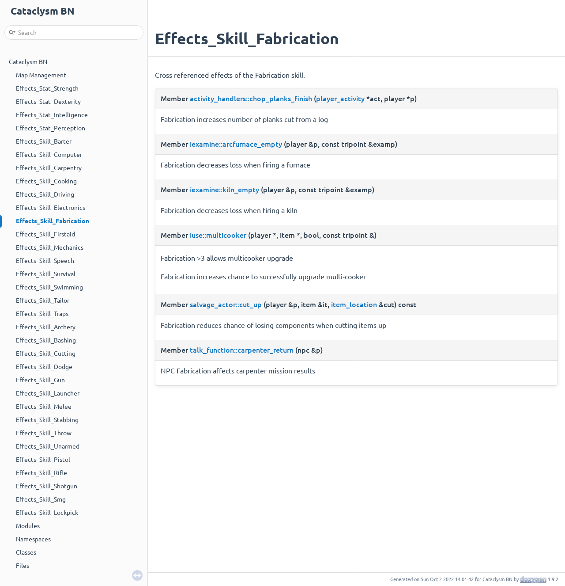

## Doxygen Comments

Extensive documentation of classes and class members will make the code more readable to new
contributors. New doxygen comments for existing classes are a welcomed contribution.

Use the following template for commenting classes:

```cpp
/**
 * Brief description
 *
 * Lengthy description with many words. (optional)
 */
class foo {

}
```

Use the following template for commenting functions:

```cpp
/**
 * Brief description
 *
 * Lengthy description with many words. (optional)
 * @param param1 Description of param1 (optional)
 * @return Description of return (optional)
 */
int foo(int param1);
```

Use the following template for commenting member variables:

```cpp
/** Brief description **/
int foo;
```

## Guidelines for adding documentation

- Doxygen comments should describe behavior towards the outside, not implementation, but since many
  classes in Cataclysm are intertwined, it's often necessary to describe implementation.
- Describe things that aren't obvious to newcomers just from the name.
- Don't describe redundantly: `/** Map **/; map* map;` is not a helpful comment.
- When documenting X, describe how X interacts with other components, not just what X itself does.

## Building the documentation for viewing it locally

:::danger

Doxygen pages are currently unmaintained.

:::


<!--  -->

<!-- Autogenerated documentation is hosted on
[GitHub Pages](https://cataclysmbnteam.github.io/Cataclysm-BN). -->

- Install doxygen
- `doxygen doxygen_doc/doxygen_conf.txt`
- `firefox doxygen_doc/html/index.html` (replace firefox with your browser of choice)
