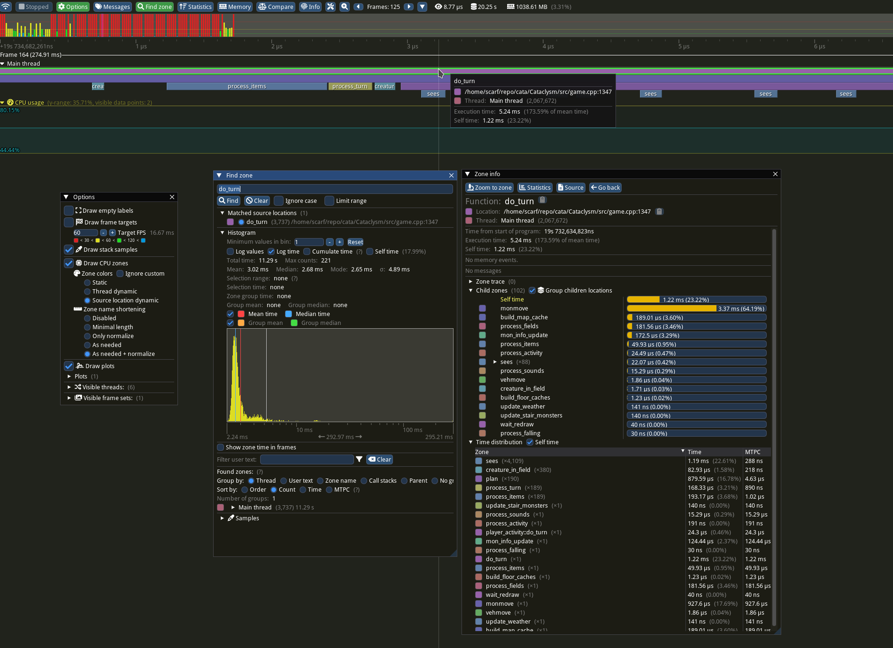

[Tracy](https://github.com/wolfpld/tracy) is a realtime profiler which you can use to analyze
performance bottleneck. It consists of two parts: client and profiler. The client integrated in BN
sends profiling data to the profiler. As the client is opt-in, you need to build BN with tracy
client in order to start profiling.

## Install Tracy Profiler

:::caution

Both the game and profiler have to be built with same version of tracy to work properly. Due to
[numerous issues](https://github.com/cataclysmbnteam/Cataclysm-BN/pull/3253#discussion_r1545267113),
The windows version uses [`v0.10`](https://github.com/wolfpld/tracy/releases/tag/v0.10) wheras the
linux version uses
[`6d1deb5640ed11da01995fb1791115cfebe54dbf`](https://github.com/wolfpld/tracy/commit/6d1deb5640ed11da01995fb1791115cfebe54dbf).

:::

### Linux

```sh
$ git clone https://github.com/wolfpld/tracy
$ cd tracy
$ git checkout 6d1deb5640ed11da01995fb1791115cfebe54dbf # the commit used by BN tracy client
```

1. Clone <https://github.com/wolfpld/tracy>.

```sh
# for ubuntu (X11)
$ sudo apt install cmake clang git libcapstone-dev xorg-dev dbus libgtk-3-dev

# for ubuntu (wayland)
$ sudo apt install libglfw-dev libgtk-3-dev libfreetype6-dev libtbb-dev debuginfod libwayland-dev dbus libxkbcommon-dev libglvnd-dev meson cmake git wayland-protocols

# for arch, copied from https://github.com/wolfpld/tracy/blob/master/.github/workflows/linux.yml#L16C12-L16C163
$ pacman -Syu --noconfirm && pacman -S --noconfirm --needed freetype2 tbb debuginfod wayland dbus libxkbcommon libglvnd meson cmake git wayland-protocols
```

2. Install dependencies.

```sh
$ cmake -B profiler/build -S profiler # if you're using wayland
```

3. Set up cmake. By default tracy uses wayland, if you want to use X11, you need to add `LEGACY=1`
   flag.

:::note{title="for X11"}

```sh
$ cmake -DLEGACY=ON -B profiler/build -S profiler # if you're using X11
```

tracy uses wayland by default, if you want to use X11, you need to add `LEGACY=1` flag.

:::

:::note{title="fileselector fixes"}

```sh
$ cmake -DGTK_FILESELECTOR=ON -B profiler/build -S profiler
```

Due to issues with [default fileselector (xdg-portal)](https://github.com/wolfpld/tracy/issues/764),
tracy may fail to open or save trace history. As an workaround, add `GTK_FILESELECTOR=ON` in compile
flags to use gtk fileselector.

:::

```sh
$ cmake --build profiler/build --config Release --parallel $(nproc)
```

4. Build the binary. It will be available on `./profiler/build/tracy-profiler`.

:::tip{title="Adding desktop entry"}

```
[Desktop Entry]
Version=1.0
Type=Application
Name=Tracy Profiler
GenericName=Code profiler
GenericName[pl]=Profiler kodu
GenericName[ko]=코드 프로파일러
Comment=Examine code to see where it is slow
Comment[pl]=Znajdowanie wolno wykonującego się kodu
Comment[ko]=코드 분석해서 느린 곳 찾기
Exec=<THE_PATH_WHERE_YOU_INSTALLED_TRACY>/profiler/build/tracy-profiler %f
Icon=<THE_PATH_WHERE_YOU_INSTALLED_TRACY>/icon/icon.ico
Terminal=false
Categories=Development;Profiling;
MimeType=application/tracy;
X-Desktop-File-Install-Version=0.26
```

To make the profiler available in app runner, create `$HOME/.local/share/applications/tracy.desktop`
file with the following content. Make sure to replace `<THE_PATH_WHERE_YOU_INSTALLED_TRACY>` with
the path where you installed tracy!

:::

### Windows


Download pre-compiled executable from <https://github.com/wolfpld/tracy/releases>.

## Build BN with Tracy Client

Build on [cmake](../guides/building/cmake.md) with `-D USE_TRACY=ON` flag. For example,

```sh
$ cmake -B build -DUSE_TRACY=ON ...other flags...
```

See [CMake options](building/cmake.md#cataclysmbn-specific-options) for more information.

## Mark zone to profile

Mark `ZoneScoped` in the function you'd like to profile. It will be displayed in the tracy GUI. For
example,

```cpp
bool game::do_turn()
{
    ZoneScoped;

    /** Other code... */
}
```

There are also more complex profiling macros available. Check following links for more:

- <https://github.com/wolfpld/tracy>
- <https://luxeengine.com/integrating-tracy-profiler-in-cpp/>
- [An Introduction to Tracy Profiler in C++ - Marcos Slomp - CppCon 2023](https://www.youtube.com/watch?v=ghXk3Bk5F2U)

## Use Tracy Profiler

1. Start BN (built with `USE_TRACY=ON`), and run the tracy profiler.


2. Click `connect` button to connect to the game.



3. Profiling data will be displayed in the GUI.
