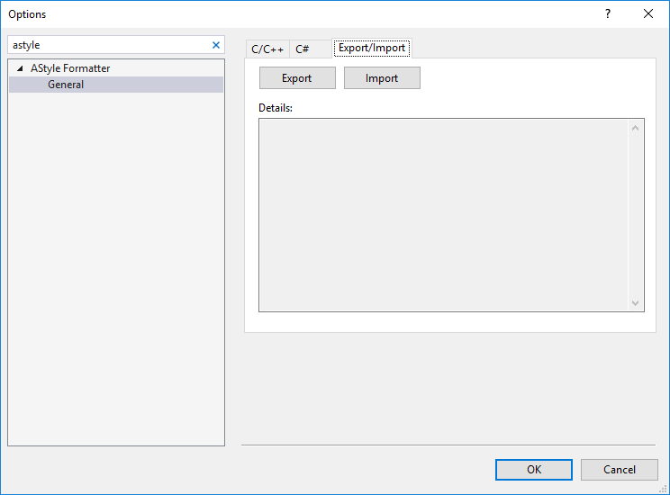
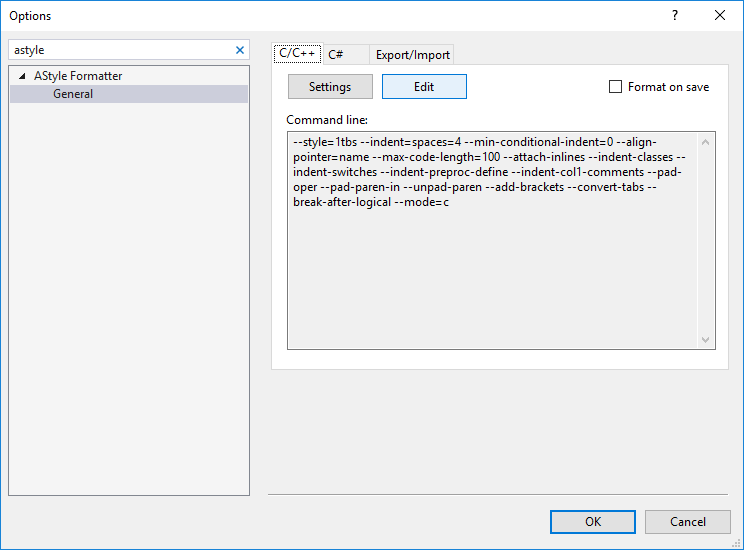
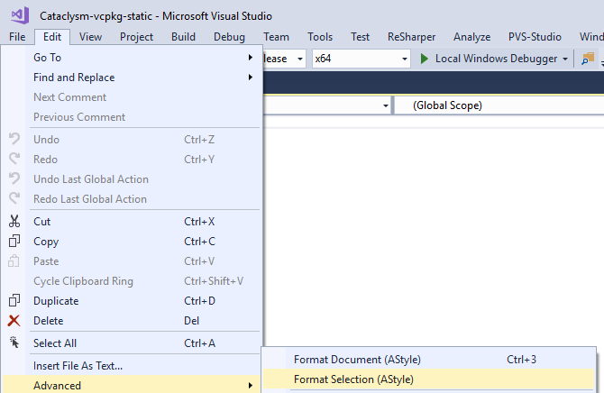
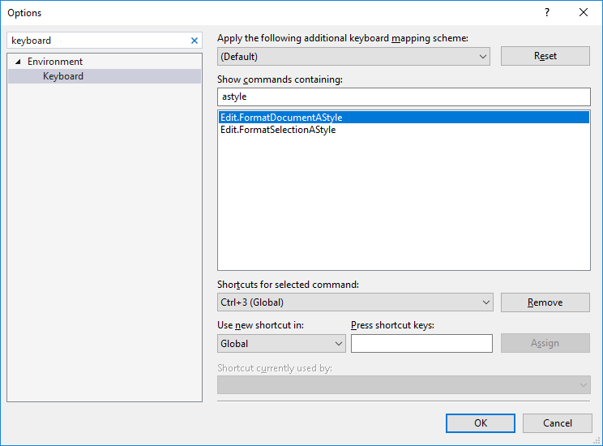

## Code style (astyle)

Automatic formatting of the source code is performed by
[Artistic Style](http://astyle.sourceforge.net/), or `astyle` for short.

There are multiple ways to invoke it on the codebase, depending on your system or personal
preferences.

### Invoking astyle directly

If you only have `astyle` installed, use:

```sh
astyle --options=.astylerc --recursive src/*.cpp,*.h tests/*.cpp,*.h tools/*.cpp,*.h
```

### Invoking astyle through make

If you have both `make` and `astyle` installed, use:

```sh
make astyle
```

### Invoking astyle via pre-commit hook

If you have all the relevant tools installed, you can have git automatically check the style of code
and json by adding these commands to your git pre-commit hook (typically at
`.git/hooks/pre-commit`):

```sh
git diff --cached --name-only -z HEAD | grep -z 'data/.*\.json' | \
    xargs -r -0 -L 1 ./tools/format/json_formatter.[ce]* || exit 1

make astyle-check || exit 1
```

### Astyle extensions for Visual Studio

There are astyle extensions in the Visual Studio Marketplace, but none of them have been confirmed
(yet) to correctly work for our purposes on VS2019 or VS2022.

#### Visual Studio 2022

Head over to <https://github.com/olanti-p/BN_Astyle> and follow instructions in the
[README.md](https://github.com/olanti-p/BN_Astyle/blob/master/README.md). You may compile and
install the extension from source, or take advantage of the pre-built version in
[releases section](https://github.com/olanti-p/BN_Astyle/releases).

#### Visual Studio 2019

Extensions's source code lives over at https://github.com/lukamicoder/astyle-extension. To install
and compile it:

1. Add the `Visual Studio extension development` workload through Visual Studio installer to your
   VS2019
2. Download and extract the source code, or clone the repository (a simple
   `git clone --depth 1 https://github.com/lukamicoder/astyle-extension.git` should do).
3. From the root folder, open `astyle-extension/AStyleExtension2017.sln`
4. Select `Release` build configuration (most likely VS will select `Debug` configuration by
   default)
5. Build the solution
6. If the build succeeded, you'll see the compiled extension in `AStyleExtension\bin\Release`.
   Double click it to install.
7. Configure the extension according to
   [Configuration instructions (Visual Studio 2019 or older)](#configuration-instructions-visual-studio-2019-or-older)
   section.

#### Visual Studio 2017 or earlier

You may follow the steps for VS2019 to compile from source, but there are pre-built versions
[available](https://marketplace.visualstudio.com/items?itemName=Lukamicoder.AStyleExtension2017) on
Visual Studio Marketplace, you should be able to install the extension through VS's extension
manager and then configure it the same way.

#### Configuration instructions (Visual Studio 2019 or older):

1. Go to `Tools` - `Options` - `AStyle Formatter` - `General`.

2. Import
   `https://github.com/cataclysmbnteam/Cataclysm-BN/blob/main/msvc-full-features/AStyleExtension-Cataclysm-BN.cfg`
   on `Export/Import` tab using `Import` button:



3. After import is successful you can see imported rules on `C/C++` tab:



4. Close `Options` menu, open file to be astyled and use `Format Document (Astyle)` or
   `Format Selection (Astyle)` commands from `Edit` - `Advanced` menu.



_Note:_ You can also configure keybindings for aforementioned commands in `Tools` - `Options` -
`Environment` - `Keybindings` menu:



## JSON style

See the [JSON style guide](../../mod/json/explanation/json_style).

## ctags

In addition to the usual means of creating a `tags` file via e.g.
[`ctags`](http://ctags.sourceforge.net/), we provide `tools/json_tools/cddatags.py` to augment a
`tags` file with locations of definitions taken from CDDA JSON data. `cddatags.py` is designed to
safely update a tags file containing source code tags, so if you want both types of tag in your
`tags` file then you can run `ctags -R . && tools/json_tools/cddatags.py`. Alternatively, there is a
rule in the `Makefile` to do this for you; just run `make ctags` or `make etags`.

## clang-tidy

Cataclysm has a
[clang-tidy configuration file](https://github.com/cataclysmbnteam/Cataclysm-BN/blob/main/.clang-tidy)
and if you have `clang-tidy` available you can run it to perform static analysis of the codebase. We
test with `clang-tidy` from LLVM 18 with CI, so for the most consistent results, you might want to
use that version.

To run it, you have a few options.

- `clang-tidy` ships with a wrapper script `run-clang-tidy.py`.

- Use CMake's built-in support by adding `-DCMAKE_CXX_CLANG_TIDY=clang-tidy` or similar, pointing it
  to your chosen clang-tidy version.

- To run `clang-tidy` directly try something like

```sh
grep '"file": "' build/compile_commands.json | \
    sed "s+.*$PWD/++;s+\"$++" | \
    egrep '.' | \
    xargs -P 9 -n 1 clang-tidy -quiet
```

To focus on a subset of files add their names into the `egrep` regex in the middle of the
command-line.

## Custom clang-tidy plugin

We have written our own clang-tidy checks in a custom plugin. refer to
[clang-tidy.yml](https://github.com/cataclysmbnteam/Cataclysm-BN/blob/main/.github/workflows/clang-tidy.yml)
for the exact steps to build the plugin on ubuntu 24.04.

### Build plugin on Ubuntu 24.04

Follow exact steps in [cmake guide](../../dev/guides/building/cmake.md) with following changes:

Also install these additional dependencies:

```sh
sudo apt-get install \
  clang-18 libclang-18-dev llvm-18 llvm-18-dev clang-tidy-18
```

add `CATA_CLANG_TIDY_PLUGIN=ON` to cmake flags when configuring the build.

### Build plugin on Fedora 40

Follow exact steps in [atomic cmake guide](../../dev/guides/building/atomic_cmake.md) with following
changes:

Also install these additional dependencies:

```sh
sudo dnf install clang-devel llvm-devel clang-tools-extra
```

add `CATA_CLANG_TIDY_PLUGIN=ON` to cmake flags when configuring the build.

### Using the plugin

To run the plugin on a single file, run following command on project root:

```sh
$ ./build-scripts/clang-tidy-wrapper.sh -fix src/achievement.cpp
```

To run the plugin on multiple files, use [GNU parallel](https://www.gnu.org/software/parallel/):

```sh
$ parallel ./build-scripts/clang-tidy-wrapper.sh -fix ::: src/*.cpp
```

## include-what-you-use

[include-what-you-use](https://github.com/include-what-you-use/include-what-you-use) (IWYU) is a
project intended to optimise includes. It will calculate the required headers and add and remove
includes as appropriate.

Running on this codebase revealed some issues. You will need a version of IWYU where the following
PR has been merged (which has not yet happened at time of writing, but with luck might make it into
the clang-10 release of IWYU):

- https://github.com/include-what-you-use/include-what-you-use/pull/775

Once you have IWYU built, build the codebase using cmake, with `CMAKE_EXPORT_COMPILE_COMMANDS=ON` on
to create a compilation database (Look for `compile_commands.json` in the build dir to see whether
that worked).

Then run:

```sh
iwyu_tool.py -p $CMAKE_BUILD_DIR/compile_commands.json -- -Xiwyu --mapping_file=$PWD/tools/iwyu/cata.imp | fix_includes.py --nosafe_headers --reorder
```

IWYU will sometimes add C-style library headers which clang-tidy doesn't like, so you might need to
run clang-tidy (as described above) and then re-run IWYU a second time.

There are mapping files in `tools/iwyu` intended to help IWYU pick the right headers. Mostly they
should be fairly obvious, but the SDL mappings might warrant further explanation. We want to force
most SDL includes to go via `sdl_wrappers.h`, because that handles the platform-dependence issues
(the include paths are different on Windows). There are a couple of exceptions (`SDL_version.h` and
`SDL_mixer.h`). The former is because `main.cpp` can't include all SDL headers, because they
`#define WinMain`. All the mappings in `sdl.imp` are designed to make this happen.

We have to use IWYU pragmas in some situations. Some of the reasons are:

- IWYU has a concept of
  [associated headers](https://github.com/include-what-you-use/include-what-you-use/blob/master/docs/IWYUPragmas.md#iwyu-pragma-associated),
  where each cpp file can have some number of such headers. The cpp file is expected to define the
  things declared in those headers. In Cata, the mapping between headers and cpp files is not nearly
  so simple, so there are files with multiple associated headers, and files with none. Headers that
  are not the associated header of any cpp file will not get their includes updated, which could
  lead to broken builds, so ideally all headers would be associated to some cpp file. You can use
  the following command to get a list of headers which are not currently associated to any cpp file
  (requires GNU sed):

```sh
diff <(ls src/*.h | sed 's!.*/!!') <(for i in src/*.cpp; do echo $i; sed -n '/^#include/{p; :loop n; p; /^$/q; b loop}' $i; done | grep 'e "' | grep -o '"[^"]*"' | sort -u | tr -d '"')
```

- Due to a [clang bug](https://bugs.llvm.org/show_bug.cgi?id=20666), uses in template arguments to
  explicit instantiations are not counted, which leads to some need for `IWYU pragma: keep`.

- Due to
  [these](https://github.com/include-what-you-use/include-what-you-use/blob/4909f206b46809775e9b5381f852eda62cbf4bf7/iwyu.cc#L1617)
  [missing](https://github.com/include-what-you-use/include-what-you-use/blob/4909f206b46809775e9b5381f852eda62cbf4bf7/iwyu.cc#L1629)
  features of IWYU, it does not count uses in template arguments to return types, which leads to
  other requirements for `IWYU pragma: keep`.

- IWYU seems to have particular trouble with types used in maps. Have not looked into this in
  detail, but again worked around it with pragmas.
