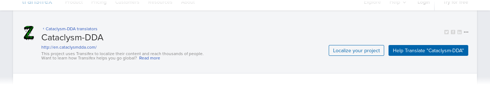
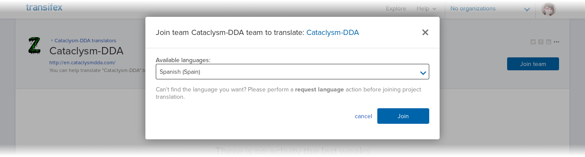
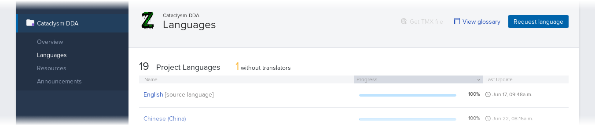
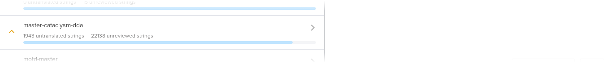
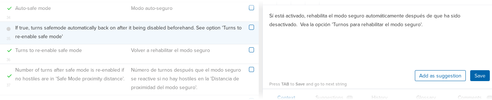

## Supported languages

The official location for translating Cataclysm: BN is the
[Transifex translations project][project].

[Looking for a way to translate mods not included in game repository?](../guides/mods.md)

Some of the currently supported languages are:

- Arabic
- Bulgarian
- Chinese (Simplified)
- Chinese (Traditional)
- Dutch
- Esperanto
- French
- German
- Italian (Italy)
- Japanese
- Korean
- Polish
- Portuguese (Brazil)
- Russian
- Serbian
- Spanish (Argentina)
- Spanish (Spain)
- Turkish

Don't see your language in the list above? You can add it into the project at Transifex!

## Join the BN team

To begin translating, head over the [translation project][project] and click on the
`Help Translate Cataclysm: BN` button. This should take you to a page where you can either create a
free account on Transifex, or login using GitHub, Google+ or LinkedIn.

After you've created your account, return to the [translation project][project] and click on the
"Join team" button. This will open a window where you can choose the language you are interested on
translating, so pick one and click the "Join" button.

## Choose a language

After this, the most straightforward thing to do is to reload the page, which should redirect you to
the translation project's dashboard. Here, you can click the "Languages" link on the sidebar to see
the list of supported languages and the current progress of the translation effort.

Note that you can request for the inclusion of additional languages, if the one you are interested
in is not available on the list.

From this list, you can click on the language of your choice, and then click on the "Translate" to
get started right away. Otherwise, you can click on any other language and click on the "Join team"
button, if you are interested in translating for that language as well.

After clicking on the "Translate" button, you will be taken to the web editor. To begin, you need to
choose a resource to translate. Most of the in-game text is contained in the
`cataclysm-bright-nights` resource, so click on it to start.

## Using the editor

At this point, the editor should show you the list of text available for translation, now you only
need to click on the string you want to translate and type your translation on the translation area
on the right side of the screen. Click on the "Save" button when you are satisfied with your
translation.

See [Transifex's documentation][docs] for more information.

[project]: https://app.transifex.com/bn-team/cataclysm-bright-nights
[docs]: https://docs.transifex.com/
