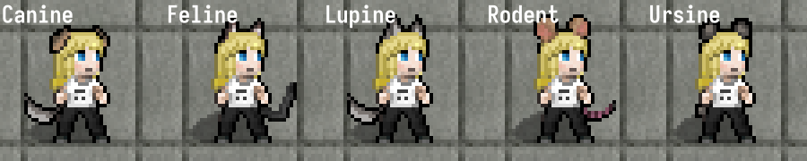
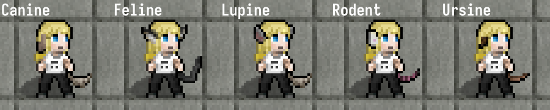

`data/json/external_tileset` is used for content specific to Bright Nights which are not presently
in primary tilesets such as UDP or Ultica, for which `looks_like` is inadequate to depict the
content to a satisfactory degree. It functions using the `mod_tileset` feature, applying any desired
new sprites or overriding sprites to the specified tileset.

The primary advantage of this method is to set aside sprites so they won't interfere with updating
the tilesets themselves (as their sources are in the repositories of the tileset authors), and
likewise ensuring anything specific to BN won't be accidentally erased, like it would if a tileset
update was submitted to BN after these editing these sprites our versions of the tilesets. It also
covers divergences in content were, by nessecity, a different sprite is a better fit.

Links to relevant pull requests, for content covered below:

- Steam turbine: [#2815](https://github.com/cataclysmbnteam/Cataclysm-BN/pull/2815)
- Bullet animations: [#1861](https://github.com/cataclysmbnteam/Cataclysm-BN/pull/1681)
- Wooden shields, riot shields, and ballistic shields:
  [#2851](https://github.com/cataclysmbnteam/Cataclysm-BN/pull/2851)
- Lead sling bullet: [#2709](https://github.com/cataclysmbnteam/Cataclysm-BN/pull/2709)
- Leather and banded shields: [#2856](https://github.com/cataclysmbnteam/Cataclysm-BN/pull/2856)
- Edits to blueberry bushes, strawberry bushes, and cherry trees:
  [#2861](https://github.com/cataclysmbnteam/Cataclysm-BN/pull/2861)
- De-obsoleted wooden greatbow, reflavored compound/composite greatbow:
  [#2862](https://github.com/cataclysmbnteam/Cataclysm-BN/pull/2862)
- Katar and sai: [#2715](https://github.com/cataclysmbnteam/Cataclysm-BN/pull/2715)
- Utility light can be switched off:
  [#1003](https://github.com/cataclysmbnteam/Cataclysm-BN/pull/1003)
- Mi-go nerve cluster: [#1962](https://github.com/cataclysmbnteam/Cataclysm-BN/pull/1962)
- Scaled bear: [#1371](https://github.com/cataclysmbnteam/Cataclysm-BN/pull/1371)
- Buckler and welded shield: [#2878](https://github.com/cataclysmbnteam/Cataclysm-BN/pull/2878)
- Battle masks and bronze arm guards:
  [#3221](https://github.com/cataclysmbnteam/Cataclysm-BN/pull/3221)
- Rewired street lights: [#3273](https://github.com/cataclysmbnteam/Cataclysm-BN/pull/3273)
- Alternative ear/tail mutation: [#3340](https://github.com/cataclysmbnteam/Cataclysm-BN/pull/3340)
- New trees: [#3626](https://github.com/cataclysmbnteam/Cataclysm-BN/pull/3626)
- Alternative sign sprite: [#3670](https://github.com/cataclysmbnteam/Cataclysm-BN/pull/3670)

## Undead People

The following is a current list of sprites this folder adds to the UDP tileset, in which files and
for what purpose. This is currently the only tileset with external_tileset coverage, but sprites for
Ultica are planned for the future.

### External_Tileset_DP_Normal.png

- Furniture form of steam turbines, to be deconstructed for advanced steam engine. Content specific
  to BN.
- Animation effects for bullets in flight. Feature specific to BN.
- Wooden shield, including worn and wielded. Item specific to BN.
- Riot shield, including worn and wielded. Item specific to BN.
- Ballistic shield, including worn and wielded. Item specific to BN.
- Lead sling bullet. Item specific to BN, `looks_like` of `rock` did not seem fitting
- Leather-reinforced shield, including worn and wielded. Item specific to BN.
- Large leather-reinforced shield, including worn and wielded. Item specific to BN.
- Banded shield, including worn and wielded. Item specific to BN.
- Large banded shield, including worn and wielded. Item specific to BN.
- Swapped spring and summer sprites (the latter not depicting young berries) for blueberry bush, as
  harvest season has been moved in BN.
- Swapped spring and summer sprites (the latter not depicting young berries) for strawberry bush, as
  harvest season has been moved in BN.
- Fixed worn sprite for `woodgreatbow`, as it had a sprite error in its UDP version.
  `Note: this can be removed once UDP is updated in BN, as the fix has been published in the source repository.`
- Overriding sprite for `compgreatbow`, as its version in BN is modeled after a composite bow
  instead of a compound bow.
- New worn sprite for `compgreatbow`, as compound greatbow in DDA can't be worn thus UDP lacks a
  worn sprite for it (which we'd liklely need to edit to resemble composite bow anyway).
- Katar, including sprite for wielded state. Item specific to BN.
- Sai (weapon, not to be confused with telecoms location), including sprite for wielded state. Item
  specific to BN.
- Welded shield, including worn and wielded. Item specific to BN.
- Buckler, including worn and wielded. Item specific to BN.
- Battle masks, iron and bronze, including worn sprites. Items specific to BN.
- Bronze arm guards, including worn sprites. Item specific to BN.
- Cacao pods. Item specific to BN.

### External_Tileset_DP_Tall.png

- Off state for utility light. Ability to switch on and off specific to BN.
- Alien nerve cluster, furniture added to mi-go locations in BN.
  `Note: this can be removed once UDP is updated in BN, as the sprite for this has been published in the source repository.`
- Scaled bear, including corpse. Monster specific to BN.
- Cherry tree uses summer sprite (plus cherry blossom coloration), summer sprite depicted without
  berries, due to harvest season being moved in BN.
- Rewired street light, including active state. Furniture specific to BN.
- Cocoa tree. Terrain specific to BN.
- Cocoa plant. Terrain specific to BN.
- Override for sign sprite. Removes lettering on the front specific to DDA.

### alternative_mutation_tileset.png

Before

contains alternative sprites for:

- `FELINE_EARS`
- `LUPINE_EARS`
- `MOUSE_EARS`
- `CANINE_EARS`
- `TAIL_FLUFFY`
- `TAIL_STUB`
