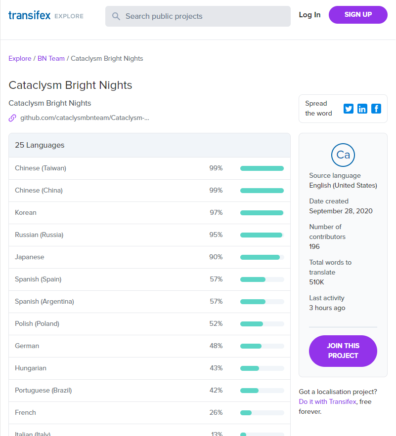
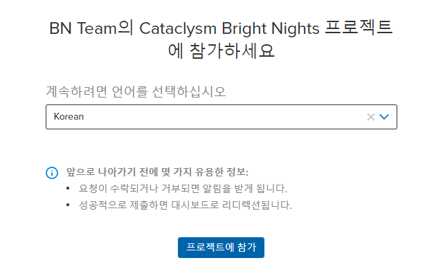
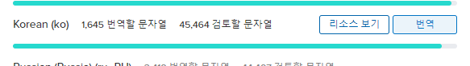

## 지원하는 언어

Cataclysm: BN 을 번역하는 공식적인 사이트는 [Transifex translations project][project] 입니다.

[게임 저장소에 포함되지 않은 모드를 번역하는 방법을 찾고 계신가요?](../guides/mods.md)

현재 지원되는 언어는 다음과 같습니다:

- 아랍어
- 불가리아어
- 중국어(간체)
- 중국어(번체)
- 네덜란드어
- 에스페란토
- 프랑스어
- 독일어
- 이탈리아어(이탈리아)
- 일본어
- **한국어**
- 폴란드어
- 포르투갈어(브라질)
- 러시아어
- 세르비아어
- 스페인어(아르헨티나)
- 스페인어(스페인)
- 터키어

위 목록에 찾는 언어가 없으신가요? Transifex에서 프로젝트에 추가할 수 있습니다!

## BN 팀에 들어가기

번역을 시작하려면 [번역 프로젝트][project]로 이동해주세요. 우측 사이드바에 `JOIN THIS PROJECT` 를
통해 로그인 / 회원가입을 하는 화면으로 갈 수 있습니다. Transifex에 무료 계정을 만들 수도 있지만
GitHub, Google+ 또는 LinkedIn을 사용하여 로그인할 수도 있습니다.

계정을 만든 후에는 [번역 프로젝트][project]로 돌아와서 `JOIN THIS PROJECT` 버튼을 클릭합니다. 그러면
번역에 관심 있는 언어를 선택할 수 있는 창이 열립니다. 번역하고 싶은 언어를 선택하고
`프로젝트에 참가` 버튼을 클릭합니다.

## 언어 선택하기

참가 요청이 받아들여지고 페이지를 새로고침하면 프로젝트 대시보드로 리다이렉트될 것입니다. 사이드바에
있는 `Languages` 링크를 클릭하여 지원되는 언어 목록과 현재 번역 작업 진행 상황을 확인할 수 있습니다.
만약 번역하고 싶은 언어가 목록에 없다면 추가 요청도 할 수 있습니다.

목록에서 원하는 언어를 클릭한 후 "Translate" 버튼을 클릭하여 바로 시작할 수 있습니다. 다른 언어도
번역하고 싶다면, 그 언어를 클릭한 후 "Join team" 버튼을 클릭할 수도 있습니다.

"Translate" 버튼을 클릭하면 웹 편집기로 이동하는데, 번역을 시작하려면 번역할 자료를 선택해야 합니다.
거의 대부분의 게임 내 텍스트는 `cataclysm-bright-nights` 자료에 포함되어 있으므로 이 항목을 선택하면
됩니다.

## 편집기 사용하기

편집기에서는 번역해야할 문장 목록이 나옵니다. 번역하고 싶은 문장을 클릭한 후 오른쪽 입력란에 번역된
문장을 입력하면 됩니다. 번역이 마치고 "Save" 버튼을 누르면 변경 내역이 저장됩니다.

더 자세한 내용은 [Transifex 공식 문서][docs]를 참고해주세요.

[project]: https://explore.transifex.com/bn-team/cataclysm-bright-nights/
[docs]: https://docs.transifex.com/
