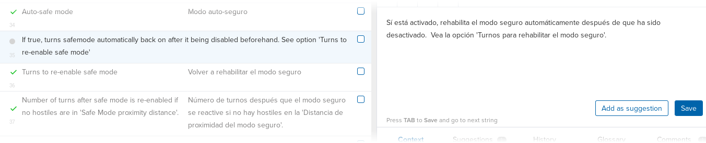

## Supported languages

Cataclysm: BN 을 번역하는 공식적인 사이트는 [Transifex translations project][project] 입니다.

[게임 저장소에 포함되지 않은 모드를 번역하는 방법을 찾고 계신가요?](../guides/mods.md)

현재 지원되는 언어는 다음과 같습니다:

- 아랍어
- 불가리아어
- 중국어(간체)
- 중국어(번체)
- 네덜란드어
- 에스페란토
- 프랑스어
- 독일어
- 이탈리아어(이탈리아)
- 일본어
- 한국어
- 폴란드어
- 포르투갈어(브라질)
- 러시아어
- 세르비아어
- 스페인어(아르헨티나)
- 스페인어(스페인)
- 터키어

위 목록에 귀하의 언어가 표시되지 않나요? Transifex에서 프로젝트에 추가할 수 있습니다!

## BN 팀에 들어가기

번역을 시작하려면 [번역 프로젝트][project]로 이동하여 주십시오. 우측 사이드바에 `JOIN THIS PROJECT` 를 통해 로그인 / 회원가입을 하는 화면으로 갈 수 있습니다. Transifex에 무료 계정을 만들 수도 있지만 GitHub, Google+ 또는 LinkedIn을 사용하여 로그인할 수도 있습니다.

계정을 만든 후에는 [번역 프로젝트][project]로 돌아와서 `JOIN THIS PROJECT` 버튼을 클릭합니다. 그러면 번역에 관심 있는 언어를 선택할 수 있는 창이 열립니다. 번역하고 싶은 언어를 선택하고 `프로젝트에 참가` 버튼을 클릭합니다.

## Choose a language

참가 요청이 받아들여지면, 
After this, the most straightforward thing to do is to reload the page, which should redirect you to
the translation project's dashboard. Here, you can click the "Languages" link on the sidebar to see
the list of supported languages and the current progress of the translation effort.

Note that you can request for the inclusion of additional languages, if the one you are interested
in is not available on the list.

From this list, you can click on the language of your choice, and then click on the "Translate" to
get started right away. Otherwise, you can click on any other language and click on the "Join team"
button, if you are interested in translating for that language as well.

After clicking on the "Translate" button, you will be taken to the web editor. To begin, you need to
choose a resource to translate. Most of the in-game text is contained in the
`cataclysm-bright-nights` resource, so click on it to start.

## Using the editor

At this point, the editor should show you the list of text available for translation, now you only
need to click on the string you want to translate and type your translation on the translation area
on the right side of the screen. Click on the "Save" button when you are satisfied with your
translation.

See [Transifex's documentation][docs] for more information.

[project]: https://explore.transifex.com/bn-team/cataclysm-bright-nights/
[docs]: https://docs.transifex.com/
