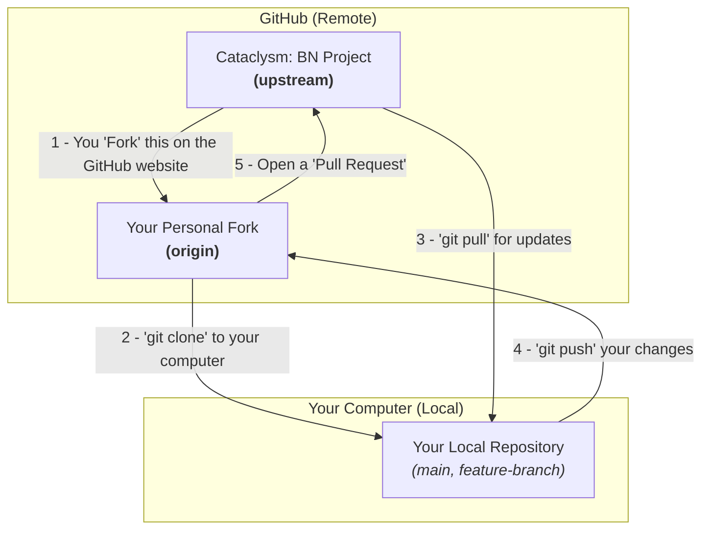
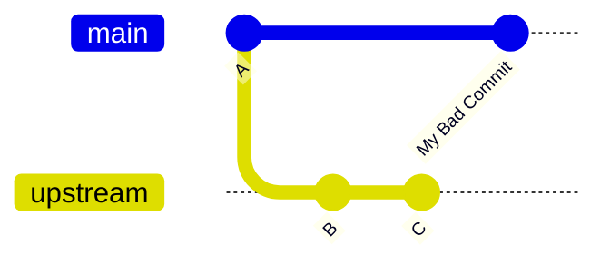
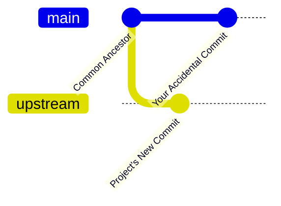
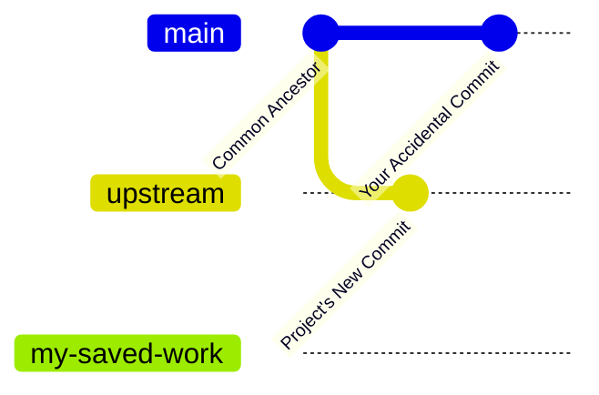
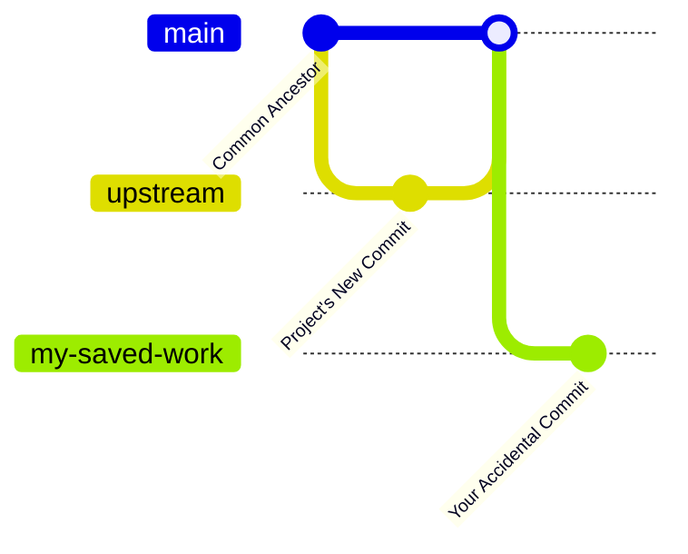

# Contributing to Cataclysm: Bright Nights

First off, thank you for considering contributing! We're excited to have your help. This project is the result of the hard work of many people, and we appreciate you joining us.

This guide is designed to make contributing as easy as possible. We've split it into two sections:

-   [**For Newcomers**](#for-newcomers-the-visual-guide): A step-by-step visual guide for those new to Git or contributing to open-source.
-   [**For Experienced Users**](#for-experienced-users-the-quick-guide): A quick reference for those who are already comfortable with the fork-and-pull-request workflow.

---

## For Newcomers: The Visual Guide

Welcome! We'll walk you through contributing. The core idea is to work on your own copy (a "fork") and then propose merging your changes back into the main project via a "Pull Request".

### The Big Picture: Remotes and Repositories

Before we start, let's clarify the key terms. You will be interacting with three different locations for the code:

*   **`upstream`**: The official Cataclysm: BN repository on GitHub. This is the single source of truth.
*   **`origin`**: Your personal copy (fork) of the repository on GitHub. You have full write access here.
*   **`local`**: The repository cloned onto your computer. This is where you will edit files.

The relationship and the typical flow of changes between them looks like this:



### Step 1: Setting Up Your Environment (One-Time Only)

This setup configures your local environment to easily sync with the official project.

1.  **Fork the Repository:**
    *   Go to the [Cataclysm: BN repository page](https://github.com/cataclysmbnteam/Cataclysm-BN).
    *   Click the "Fork" button in the top-right corner. This creates your own copy on GitHub (`YourUsername/Cataclysm-BN`).

2.  **Clone Your Fork Locally:**
    *   Go to *your* forked repository page.
    *   Click the green "<> Code" button and copy the HTTPS URL.
    *   Open your terminal and run the following (replace `YOUR_USERNAME`):
    ```sh
    # Clones your fork to a new folder named "Cataclysm-BN"
    git clone https://github.com/YOUR_USERNAME/Cataclysm-BN.git

    # Navigate into the newly created directory
    cd Cataclysm-BN
    ```

3.  **Link to the `upstream` Repository:**
    *   Now, you will tell your local repository where the *original* project is. This is crucial for keeping your copy updated.
    ```sh
    # Add the original project as a remote named "upstream"
    git remote add upstream https://github.com/cataclysmbnteam/Cataclysm-BN.git

    # Verify that both 'origin' and 'upstream' are configured
    git remote -v
    # origin    https://github.com/YOUR_USERNAME/Cataclysm-BN.git (fetch)
    # origin    https://github.com/YOUR_USERNAME/Cataclysm-BN.git (push)
    # upstream  https://github.com/cataclysmbnteam/Cataclysm-BN.git (fetch)
    # upstream  https://github.com/cataclysmbnteam/Cataclysm-BN.git (push)
    ```

4.  **Configure Your `main` Branch:**
    *   This final, important step sets your local `main` branch to directly track the official project's `main` branch. This simplifies keeping your project up-to-date.
    ```sh
    # Fetch the latest info from upstream
    git fetch upstream

    # Set your local main branch to track upstream's main branch
    git branch main --set-upstream-to=upstream/main
    ```
    Now, when you are on your `main` branch, running `git pull` will automatically get updates from the official project, not from your fork. This is the recommended trunk-based development workflow.

### Step 2: The Contribution Workflow (For Every New Feature)

This is the cycle you'll follow each time you want to make a change.

1.  **Sync Your `main` Branch:**
    Before starting, make sure your local `main` branch has the latest changes. Thanks to our setup, this is now simple.

    ```sh
    git checkout main
    git pull
    ```
    Visually, you're ensuring your local `main` matches the `upstream/main`.
    ```mermaid
    gitGraph
       commit id: "Start"
       branch "upstream/main"
       checkout "upstream/main"
       commit id: "Update 1"
       commit id: "Update 2"
       checkout main
       commit id: "You run 'git pull'" type: REVERSE
       merge "upstream/main" id: "Now you are up to date!"
    ```

2.  **Create a New Feature Branch:**
    Never work directly on your `main` branch! Create a new, descriptively named branch for your changes.

    ```sh
    # The -b flag creates the new branch and immediately switches to it
    git checkout -b my-awesome-new-feature
    ```
    This creates a clean slate for you to work on, branching off from the latest project code.
    ```mermaid
    gitGraph
        commit id: "latest main"
        branch "my-awesome-feature"
        checkout "my-awesome-feature"
        commit id: "Work in Progress"
        commit id: "More work..."
    ```

3.  **Make Your Changes and Commit:**
    *   Edit files, add new files, and fix bugs.
    *   Once you have a logical chunk of work done, "commit" it with a clear message.

    ```sh
    git add .
    git commit -m "feat: Add laser-eyed frogs"
    ```

4.  **Push Your Branch to `origin` (Your Fork):**
    Save your work to your fork on GitHub.

    ```sh
    # Push the 'my-awesome-new-feature' branch to your 'origin' remote
    git push -u origin my-awesome-new-feature
    ```

5.  **Open a Pull Request (PR):**
    *   Go to your fork's page on GitHub (`https://github.com/YOUR_USERNAME/Cataclysm-BN`).
    *   GitHub will display a banner for your recently pushed branch. Click "Compare & pull request".
    *   Write a clear title and description. Explain *what* your change does and *why* you made it.
    *   If your PR is a work-in-progress, please [mark it as a draft](https://docs.github.com/en/pull-requests/collaborating-with-pull-requests/proposing-changes-to-your-work-with-pull-requests/about-pull-requests#draft-pull-requests).

The team will now be able to review your code and merge it into the project. Thank you for contributing

### The #1 Pitfall: Committing Directly to `main`

**Do not make commits on your `main` branch.** Your `main` branch should only ever track the official `upstream/main`. If you commit to your `main`, it will "diverge" from the official project, making it difficult to pull in future updates.

**This is what happens if you commit to `main`:**



If you do this by accident, see the FAQ section on how to fix it.

---

## For Experienced Users: The Quick Guide

We assume you're familiar with the fork-and-PR workflow.

1.  **Remotes:**
    *   `origin` should point to your fork.
    *   `upstream` should point to `https://github.com/cataclysmbnteam/Cataclysm-BN.git`.

2.  **Workflow:**
    *   Keep your local `main` branch clean and tracking `upstream/main`.
    *   Before starting work, sync: `git checkout main && git pull upstream main`.
    *   Create a feature branch: `git checkout -b my-feature upstream/main`.
    *   Rebase your feature branch on `upstream/main` as needed to resolve conflicts.
    *   Submit a PR to `cataclysmbnteam/Cataclysm-BN:main`.

3.  **Pull Request Notes:**
    *   Mark work-in-progress PRs as drafts.
    *   To auto-close issues, use keywords in the PR description (e.g., `Fixes #12345`).
    *   Ensure your code adheres to the style guides. Run formatters before committing.

---

## Code and Content Style Guides

To maintain consistency across the project, we use formatters to enforce style. Please run these before committing your changes.

-   **C++:** Enforced by `astyle`. See [CODE_STYLE](./../dev/explanation/code_style.md).
-   **JSON:** Use the custom formatter in `tools/format`. See [JSON Style Guide](./../mod/json/explanation/json_style.md).
-   **Markdown:** Formatted with `deno fmt`.
-   **Lua:** Formatted with `dprint`. See [Lua Style Guide](./../mod/lua/explanation/lua_style.md).

## Translations

Translations are managed on Transifex. Please see the [translation project page](https://app.transifex.com/bn-team/cataclysm-bright-nights/) and read the documentation for [translators](./../i18n/tutorial/transifex) and [developers](./../i18n/reference/translation).

## Documentation and Testing

-   **Doxygen:** New C++ code should be documented. See the original guide for templates.
-   **Unit Tests:** Run the test suite with `make check` after any change to game source to ensure you haven't broken anything.
-   **In-Game Testing:** Use the debug menu to spawn items, teleport, and set up scenarios to test your changes effectively.

You're absolutely right. Visualizing the problem and the solution is key to helping newcomers understand Git concepts. Here is the revised FAQ section with ample `gitGraph` diagrams to illustrate the process.

---

## FAQ

### Why does `git pull --ff-only` result in an error?

This is a very common issue for newcomers! This error means you have made commits directly on your `main` branch, while the official project's `main` branch has also received new commits. Your local `main` and the project's `main` have "diverged," and Git cannot automatically combine them with a simple "fast-forward."

**The Problem State:**

Imagine the project's history moves forward with a new commit. At the same time, you accidentally add your own commit directly to your local `main` branch instead of a feature branch. The histories now look like this:



Don't worry, this is easy to fix without losing your work!

---

**The Solution: A Step-by-Step Visual Guide**

We will move your accidental commit to a new branch and then reset your `main` branch to match the official project.

#### Step 1: Safeguard Your Work

First, we create a new branch called `my-saved-work`. This acts as a bookmark for the commit you accidentally made on `main`. Your work is now safe on this new branch.

```sh
# This command creates a new branch pointing to your current main
git branch my-saved-work
```

Your repository now looks like this. Notice how both `main` and `my-saved-work` point to your commit:



---

#### Step 2: Reset Your `main` Branch

Now we will reset your `main` branch to be identical to the official project's `main` branch (`upstream/main`).

```sh
# First, make sure you are on the main branch
git checkout main

# Then, reset it to match the upstream branch.
# The --hard flag discards any local changes on main.
git reset --hard upstream/main
```

Your `main` branch is now clean and exactly matches the project's history. Your work is still safe on the `my-saved-work` branch.



---

#### Step 3: Continue Your Work

Your `main` branch is now fixed! You can switch to your new, safe branch to continue working on your feature.

```sh
git checkout my-saved-work
```

Your repository is now in a healthy state. You have a clean `main` branch for pulling future updates and a separate feature branch (`my-saved-work`) where you can continue your development. From here, you can follow the normal contribution workflow.
