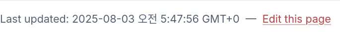
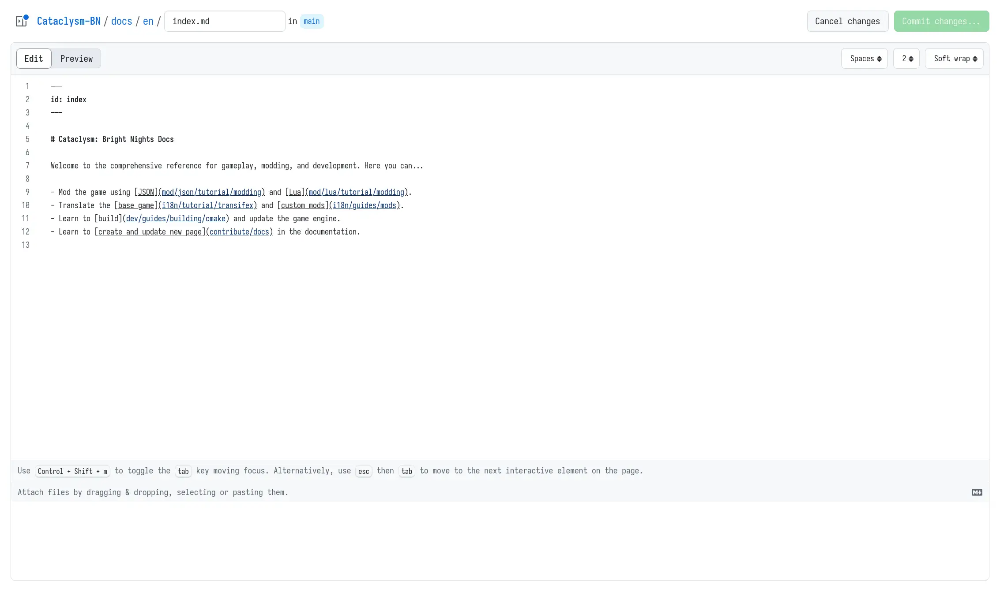

# Updating documentation

To update the documentation site, you need to:

- [learn markdown in y minutes](https://learnxinyminutes.com/docs/markdown/)
- [create a github account](https://github.com/join) as the source code for docs site is hosted on
  github.

## Browser



1. Click the `Edit page` button at the bottom of the page.



2. You will be redirected to the github page of the documentation site. You can edit and preview your changes here.

> [!NOTE]
>
> - `.md` in `CONTRIBUTING.md` stands for markdown files
> - `.mdx` in `docs.mdx` stands for [MarkDown eXtended](https://mdxjs.com)
>   - it's a superset of markdown with javascript and [jsx component][jsx] support
>   - they are a bit more complicated but allows to use interactive components

[jsx]: https://www.typescriptlang.org/docs/handbook/jsx.html


3. Click the `Commit changes...` button on the top right corner to [commit your changes](https://github.com/git-guides/git-commit). Make sure to

- Write a short and descriptive `Commit message`
- Check the `Create a new branch for this commit and start a pull request` checkbox.


4. You will be redirected to the `Comparing changes` page. Click the `Create pull request` button to [create a pull request](./contributing.md#pull-request-notes).


5. Click the `Create pull request` button to [open a PR](./contributing.md#pull-request-notes). It's okay to leave the PR body empty for small changes.

## Local development

> [!NOTE]
>
> This section assumes you have some knowledge of [git](https://git-scm.com) and [javascript](https://developer.mozilla.org/en-US/docs/Web/JavaScript). Of course, you can learn them as you go.

To run the documentation site locally, you need to:

- install [deno](https://deno.com) to format and generate automated documentation

### Setup dev server

```sh
(Cataclysm-BN) $ deno task docs serve

# or if you are already inside the docs directory
(Cataclysm-BN/docs) $ deno task serve
```

You will be able to access the documentation site at `http://localhost:3000`. The dev server will automatically reload when you make changes to the documentation.

### Automated page generation

Lua and CLI docs are generated automatically from the source code. To generate them, go to project root and run:

```sh
(Cataclysm-BN) $ deno task docs:gen
```

## License

- By contributing to markdown files (including, but not limited to `.md` and `.mdx` files), you agree to license your contributions under [CC-BY-SA 3.0](https://creativecommons.org/licenses/by-sa/3.0/), the same license as the game.

- By contributing to source code of documentation page (including, but not limited to `.ts` files), you agree to license your contributions under [AGPL 3.0](https://www.gnu.org/licenses/agpl-3.0.en.html).
